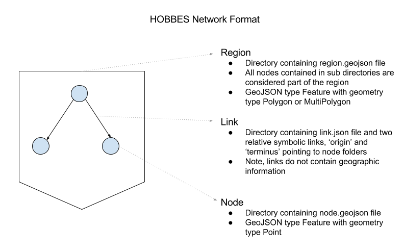

# hobbes-network-format
Hobbes network filesystem (HNF) format library and validator



## README Overview

- [Network Identifiers](#network-identifiers)
- [File Types](#file-types)
- [Folder Structure](#folder-structure)
- [Referencing Data Files](#referencing-data-files)
- [Command Line Tool](#command-line-tool)


## Network Identifiers

All nodes, links and regions in the network will be given an identifier based on the full path to the
folder containing the node link or region.  Note, only one node, link or region file is allowed per
folder.

### Example

Say we have the following format file format:

- california
  - delta
    - region.json
    - delta-link
      - link.json
      - origin
      - terminus
    - north-bay
      - node.json
    - central-basin-west
      - node.json

This would create:
- region, id: california/delta
- link, id: california/delta-link
- node, id: california/north-bay
- node, id: california/central-basin-west

## File Types

The Hobbes network filesystem as three file types:
[nodes](#nodes), [links](#links) and [regions](#regions).
Please see sections below for details on each.

#### Nodes

Nodes should be geojson formatted with type 'Feature' and geometry type 'Point'.  Nodes
should be specified in their own folder with filename **node.geojson** or **node.json**.

```json
{
  "type" : "Feature",
  "geometry" : {
    "type" : "Point",
    "coordinates" : [0, 0]
  },
  "properties" : {
    "value" : 123,
    "other" : "prop"
    ....
  }
}
```

Additional information will be added by the Hobbes Network Filesystem crawler in
under node.properties.hobbes :

```js
hobbes : {
  // nodes will always be of hobbes type 'node' 
  type : 'node',
  
  // hobbes unqiue identifier for node, generated from path
  id : String,

  // list of all parent region identifiers.
  regions : [],
  // Parent region identifier
  region : String,
  
  // git repository information
  repo : {
    
    // remote origin domain name, ex: 'github.com'
    origin : String,
    
    // repository path, 'org/repo'
    repository : String,
    
    // within the repo, path to the root of the network tree, ex: '/data'
    networkDataPath : String,
    
    // latest tag
    tag : String,
    
    // current commit
    commit : String,
    
    // path from networkDataPath to parent folder
    path : String,
    
    // name of file, ex: 'node.json'
    filename : String,
    
    // $ref information
    files : [
      {
        // path provided by the $ref attribute
        path : String,
        // $ref attribute path within the object.  ex: properties.sinks.0.default.flow.$ref
        attribute : String
      } // ...
    ]
  }
  
  // links that have this node as the terminus
  origins : [
    {
      // origin node id
      node : String,
      // origin link id
      link : String
    }, // ...
  ],

  // links that have this node as the origin
  terminals : [
    {
      // terminus node id
      node : String,
      // terminus link id
      link : String
    }, // ...
  ]
}
```

#### Links

Links should be JSON formatted.  However, the link MUST provide an 'origin' and 'terminus' 
symbolic links within the same directory. The 'origin' and 'terminus' should point at the 
origin node and terminus folders respectively.  The Hobbes Network Filesystem crawler
will lookup the origin and terminus nodes when crawling the network and set the
appropriate 'LineString' geometry based on the geometry of the two nodes.  The JSON object
will be set as the 'properties' of the newly created GeoJSON object.


```json
{
    "value" : 345,
    "other" : "prop"
}
```

Additional information will be added by the Hobbes Network Filesystem crawler in
under node.properties.hobbes.

```js
hobbes : {
  // links will always be of hobbes type 'link' 
  type : 'link',
  
  // hobbes uid for link, generated from path
  id : String,
  
  // Origin node id
  origin : String,

  // Terminus node id
  terminus : String,

  // list of all parent region identifiers.  Including origin and terminus nodes
  regions : [],
  // Parent region identifier
  region : String,
  
  // git repository information
  repo : {
    
    // remote origin domain name, ex: 'github.com'
    origin : String,
    
    // repository path, 'org/repo'
    repository : String,
    
    // within the repo, path to the root of the network tree, ex: '/data'
    networkDataPath : String,
    
    // latest tag
    tag : String,
    
    // current commit
    commit : String,
    
    // path from networkDataPath to parent folder
    path : String,
    
    // name of file, ex: 'link.json'
    filename : String,
    
    // $ref information
    files : [
      {
        // path provided by the $ref attribute
        path : String,
        // $ref attribute path within the object.  ex: properties.flow.$ref
        attribute : String
      } // ...
    ]
  }
}
```


#### Regions

Regions should be geojson formatted with type 'Polygon' or 'MultiPolygon'.  


```json
{
  "type" : "Feature",
  "geometry" : {
    "type" : "Polygon",
    "coordinates" : [[[], [], ....]]
  },
  "properties" : {
    "other" : "prop"
    ....
  }
}
```

Additional information will be added by the Hobbes Network Filesystem Crawler in
under node.properties.hobbes.

```js
hobbes : {
  // regions will always be of hobbes type 'region' 
  type : 'region',
  
  // hobbes uid for region, generated from path
  id : String,

  // list of all parent region identifiers.  Including origin and terminus nodes
  regions : [],
  // Parent region identifier
  region : String,
  
  // git repository information
  repo : {
    
    // remote origin domain name, ex: 'github.com'
    origin : String,
    
    // repository path, 'org/repo'
    repository : String,
    
    // within the repo, path to the root of the network tree, ex: '/data'
    networkDataPath : String,
    
    // latest tag
    tag : String,
    
    // current commit
    commit : String,
    
    // path from networkDataPath to parent folder
    path : String,
    
    // name of file, ex: 'region.json'
    filename : String,
    
    // $ref information
    files : []
  },

  // List of all nodes that exist outside the region but have a link whos 
  // origin startes with the region.
  terminals : [
    {
      // outgoing link id
      link : String,
      // external node id
      node : String
    }
  ],

  // List of all nodes that exist outside the region but have a link whos 
  // origin starts at the node and whos terminus ends at a node inside the region.
  origins : [
    {
      // incoming link id
      link : String,
      // external node id
      node : String
    }
  ],

  // List of id's for all nodes within the region
  nodes : [],

  // List of id's for all links within the region or whos origin or terminus exists with
  // the region
  links : []
}
```

## Folder Structure

Your nodes, links and region should be organized by folder.  While not a requirement
(the Hobbes Network Filesystem crawler will run just fine without region.geojson files),
Regions give you a nice way to break out your nodes/links into multiple folders,
providing easier lookups when editing and avoids giant folders with an unwieldy
number of nodes.

In each folder, you should provide folders for nodes/links.  If you would like to define
the folder as region, add a region.json file.

Finally, each node/link should have it's own folder containing a node.geojson or
link.json file.  The node/link folder can then contain any number of resource
files referenced via the $ref property.  More about the $ref property below below.

**File System Structure**
- Root
  - Region1
    - Node1
      - node.geojson
      - data.csv
    - Node2
      - node.geojson
      - data.csv
    - Link1
      - link.json
      - origin
      - terminus
    - Region1a
      - Node1a
        - node.geojson
        - data.csv
  - Region2
    - Node3
      - node.geojson
    - Link2
      - link.json
      - origin
      - terminus

You can see a real world example of the calvin network [here](https://github.com/ucd-cws/calvin-network-data/tree/master/data).

## Referencing Data Files

The Hobbes Network Filesystem format is designed to help you develop network
data using the power of source control systems like Git.  In order to help track
changes within your data it is helpful to break out your node data into several
files.

Let's use the example of timeseries data.  Say for a node you want to have timeseries
data for 100 years at a 1 month interval.  You may want to update this dataset
frequently, but the node never moves.  Or, conversely, you may move the node, but
timeseries data doesn't change.  Having two separate files, one for the data
and one for the geojson, helps track when only one component changes and the other
does not.  Also, separating the data from the geojson keeps the geojson file
'human-readable' (hopefully).

#### $ref

In order to link external data files to a geojson file, we have introduced? (well
stole from JSON Schema) a $ref notation.  The $ref contains a
relative path to the file that should be read.

Let's say we have a fully formed node that looks like:
```json
{
  "type" : "Feature",
  "geometry" : {
    "type" : "Point",
    "coordinates" : [0, 0]
  },
  "properties" : {
    "timeseries" : [
      ["Date", "KAF"],
      ["1901-10", 1.23],
      ["1901-11", 1.56]
      .....
    ]
  }
}
```

We can split out the timeseries data into it's own data.csv file.  So now the
node would look like:

```json
{
  "type" : "Feature",
  "geometry" : {
    "type" : "Point",
    "coordinates" : [0, 0]
  },
  "properties" : {
    "timeseries" : {
      "$ref" : "./data.csv"
    }
  }
}
```

Were the $ref is the relative path to the data file.

#### $ref file parsing

Currently .json and .csv files have advanced parsing support.  JSON files will
be parsed as json and replace the $ref with the newly parsed object.  CSV files
will be parsed and replace the $ref with a multi dimensional array.

Other formats will be read, but there contents will be inserted as a String value.

## Command Line Tool

This repo can be used as a dependency in your project, exposing multiple helper methods
including the crawler method. Optionally, you can install this tool via npm globally and 
add the hnf command line tool:

```bash
npm install -g hobbes-network-format
```

You can then use the 'hnf' command to access various parts of the network as well
as verify all parts of the network are working.

Use --help for all options
```bash
hnf --help
```

#### Examples:

Validate your HOBBES network

```bash
hnf -d /path/to/you/data/repo
```
